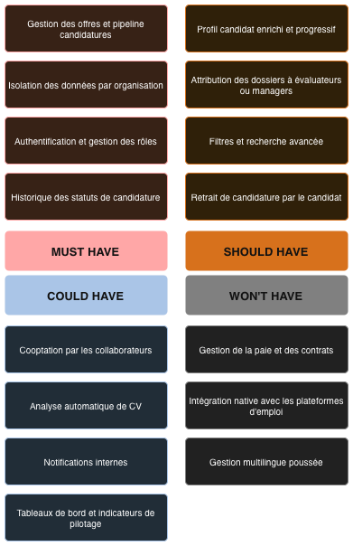

# Chapitre 2 : Spécifications et positionnement de la solution proposée

Le chapitre précédent a mis en évidence pourquoi les solutions existantes peinent à s'imposer dans le contexte sénégalais. Les ATS internationaux proposent des fonctionnalités étendues, mais supposent un niveau de maturité numérique et des moyens que beaucoup d'organisations locales ne possèdent pas encore. À l'inverse, les pratiques actuelles, fondées sur des outils génériques et des processus artisanaux, limitent la traçabilité et ralentissent la prise de décision lorsque le volume de recrutement augmente. Entre ces deux réalités, un espace existe pour une solution qui structure le recrutement sans exiger une transformation radicale des pratiques.

XpertSphere s'inscrit dans cet espace. Le présent chapitre formalise le périmètre fonctionnel de la plateforme, identifie les contraintes auxquelles elle doit répondre, et précise les hypothèses qui guident sa conception. Il s'agit d'expliciter ce que le système doit permettre pour qu'une organisation en phase de transition numérique puisse structurer ses recrutements de manière progressive et viable, sans prétendre figer un cahier des charges complet.

## 2.1 Positionnement de XpertSphere face aux solutions existantes

### 2.1.1 Synthèse des écarts observés

Les constats du chapitre précédent dessinent un espace de positionnement clair. D'un côté, les solutions internationales supposent une maturité numérique et des moyens que beaucoup d'organisations locales ne réunissent pas encore. De l'autre, les pratiques actuelles, où la diffusion est multicanale mais le suivi reste fragmenté entre messageries et tableaux manuels, atteignent rapidement leurs limites dès que le volume ou le nombre d'intervenants augmente. C'est dans cet espace qu'intervient XpertSphere, autour de trois orientations complémentaires.

### 2.1.2 Les orientations stratégiques

La première orientation concerne la progressivité. Un outil qui exige d'emblée une transformation complète des pratiques a peu de chances d'être adopté durablement. XpertSphere vise à produire de la valeur dès un usage minimal, puis à accompagner une montée en maturité à mesure que l'organisation s'approprie la plateforme. Un recruteur doit pouvoir publier une offre, recevoir des candidatures et les suivre dans un pipeline sans avoir à configurer un workflow complexe. Si l'organisation souhaite ensuite affiner ses étapes, ajouter des évaluateurs ou structurer davantage ses critères de sélection, la plateforme doit le permettre sans rupture.

Cette logique se distingue d'une approche qui imposerait un modèle unique de recrutement. Les organisations ne recrutent pas toutes de la même manière. Certaines ont des campagnes ponctuelles, d'autres un flux régulier. Certaines privilégient les réseaux et la recommandation, d'autres des canaux plus formels. Le système doit donc rester suffisamment souple pour ne pas créer de friction avec les pratiques existantes, tout en apportant une structure qui manque aujourd'hui.

La deuxième orientation porte sur la mutualisation. Proposer une infrastructure dédiée à chaque organisation rendrait le modèle économique peu viable dans un contexte où les moyens sont limités. Une plateforme partagée, où plusieurs entreprises coexistent sur la même instance applicative, permet de diluer les coûts d'exploitation tout en garantissant que chaque client travaille dans un environnement isolé. Cette mutualisation ne signifie pas que les données sont communes. Elle suppose au contraire une rigueur forte sur la séparation des accès et sur la confidentialité, de manière à ce qu'aucune organisation ne puisse consulter les offres, les candidatures ou les configurations d'une autre.

Ce modèle multi-entreprises présente aussi un intérêt plus large. Il correspond à une réalité économique partagée par de nombreux marchés émergents, où la capacité à déployer rapidement une solution sans investissement initial lourd devient un facteur d'adoption déterminant. Une plateforme partagée, accessible via un navigateur, répond à ce besoin tout en conservant une autonomie fonctionnelle pour chaque organisation cliente.

La troisième orientation concerne l'ancrage dans le contexte local. Cela va bien au-delà de proposer une interface en français ou d'adapter quelques termes. L'ancrage se joue davantage dans la manière dont le système tolère l'hétérogénéité des pratiques et des infrastructures. Les connexions peuvent être instables, les postes de travail modestes, les formats de CV variés, et les processus internes encore peu standardisés. Il faut composer avec cette réalité. La plateforme doit rester utilisable dans ces conditions, en évitant les écrans lourds, en proposant des processus guidés, et en acceptant une complétion progressive des informations.

Cette adaptation touche aussi la question de la diffusion des offres. Au Sénégal comme dans beaucoup de marchés africains, les canaux de recrutement sont multiples : réseaux sociaux, messageries, email, recommandations. XpertSphere ne cherche pas à remplacer ces canaux. À la publication d'une offre, la plateforme génère un lien partageable que l'organisation peut diffuser sur le support de son choix. Quel que soit le canal par lequel un candidat découvre l'offre, il postule depuis ce lien unique, ce qui garantit que toutes les candidatures arrivent dans le même pipeline et peuvent être suivies de manière cohérente.

Cette attention au contexte rejoint une exigence de conformité réglementaire. Le traitement des données personnelles dans le recrutement impose des règles strictes sur la collecte, la conservation et l'accès aux informations. XpertSphere doit intégrer ces contraintes dès la conception, en particulier dans un environnement multi-entreprises où les risques d'exposition involontaire de données deviennent structurants.

### 2.1.3 Tableau de positionnement comparatif

Le tableau suivant synthétise les écarts entre les solutions internationales, les pratiques locales observées, et le positionnement retenu pour XpertSphere. Les critères retenus correspondent aux dimensions identifiées dans l'analyse du contexte au chapitre précédent.

*Tableau 2.1 : Positionnement comparatif de XpertSphere*

Cette comparaison ne vise pas à disqualifier les solutions existantes. Elle permet plutôt de clarifier l'espace que XpertSphere cherche à occuper. Les grandes plateformes internationales restent adaptées aux organisations matures qui disposent des moyens pour les déployer. Les pratiques actuelles continueront à coexister, en particulier dans les structures les plus petites. XpertSphere se positionne entre ces deux réalités, en visant les organisations en phase de transition qui cherchent à structurer leurs processus sans repartir de zéro.

## 2.2 Exigences fonctionnelles

### 2.2.1 Acteurs du système et leurs rôles

Le système distingue plusieurs profils d'utilisateurs dont les besoins et les actions diffèrent. Identifier ces acteurs permet de cadrer les fonctionnalités attendues et de structurer les règles d'accès qui en découlent.

Le candidat est l'acteur externe principal. Il recherche des opportunités professionnelles, consulte des offres, dépose des candidatures et suit leur avancement. Son interaction avec la plateforme doit rester simple et transparente. Il n'appartient pas à une organisation particulière, mais peut postuler auprès de plusieurs entreprises clientes de la plateforme. Ses données de profil lui appartiennent, et il doit pouvoir les gérer de manière autonome.

Côté organisation, plusieurs rôles interviennent dans le processus de recrutement. Le recruteur pilote le cycle. Il crée les offres, les publie, consulte les candidatures et organise le suivi. Il peut également attribuer des candidatures à d'autres intervenants selon les étapes du processus. Son périmètre d'action se limite aux ressources de son organisation, sans accès aux données des autres entreprises clientes.

Le manager intervient dans la validation et l'arbitrage. Il consulte les candidatures qui lui sont soumises, donne son avis et participe à la décision finale. Son rôle se distingue de celui du recruteur par une responsabilité davantage orientée vers la décision que vers l'organisation opérationnelle du processus.

L'évaluateur technique apporte une expertise spécialisée. Lorsqu'une offre requiert des compétences techniques précises, il intervient pour évaluer les candidats sur ces aspects. Son avis doit pouvoir être conservé et mobilisé au moment de la prise de décision collective.

L'administrateur de l'organisation gère les aspects liés à la configuration interne de son entreprise cliente. Il peut créer des comptes utilisateurs, attribuer des rôles et ajuster certains paramètres. Son action reste cantonnée à son organisation, sans privilèges sur la plateforme globale.

Un dernier rôle existe au niveau de la plateforme elle-même, avec deux niveaux de privilège. L'administrateur de plateforme et le super administrateur supervisent le fonctionnement du système et la gestion des organisations clientes, le second disposant en plus de prérogatives réservées aux actions les plus sensibles. Le détail de cette répartition est précisé plus loin, avec le diagramme de cas d'utilisation qui lui est consacré. Ces deux rôles se distinguent clairement des rôles organisationnels et ne doivent jamais donner accès aux données métier des entreprises clientes.

### 2.2.2 Fonctionnalités par domaine métier

Les fonctionnalités attendues s'organisent autour de quatre domaines qui correspondent aux grandes étapes du cycle de recrutement et aux besoins d'administration.

**Gestion des offres d'emploi**

Une organisation doit pouvoir créer des offres en renseignant les informations nécessaires au besoin de recrutement. Le titre, la description du poste, les compétences attendues et les modalités contractuelles forment le socle minimal. Des éléments complémentaires comme la localisation, le mode de travail ou la fourchette salariale enrichissent l'offre sans être systématiquement obligatoires.

Une fois créée, l'offre peut être publiée. La publication la rend visible aux candidats, ouvre le dépôt de candidatures, et génère un lien partageable que l'organisation peut diffuser sur les canaux de son choix. À l'inverse, une offre en mode brouillon reste interne à l'organisation et permet de préparer le recrutement avant de l'ouvrir. Lorsqu'un recrutement se termine, l'offre peut être clôturée. Elle cesse alors d'accepter de nouvelles candidatures, mais son historique reste consultable.

Un tableau de bord permet de visualiser l'ensemble des offres d'une organisation, en distinguant celles qui sont actives, celles en préparation, et celles terminées. Des filtres facilitent la recherche lorsque le nombre d'offres augmente.

**Gestion des candidatures**

Le dépôt de candidature est le point d'entrée du processus côté candidat. Depuis une offre publiée, un candidat peut postuler en fournissant les informations demandées et en joignant son curriculum vitae. Le système vérifie qu'il n'a pas déjà postulé à cette offre, afin d'éviter les doublons involontaires.

Une fois déposée, la candidature entre dans un pipeline de suivi structuré autour de plusieurs statuts. Ces statuts reflètent les étapes courantes d'un recrutement, depuis la réception initiale jusqu'à la décision finale. Les recruteurs peuvent faire évoluer une candidature d'un statut à l'autre selon l'avancement du processus. Chaque changement de statut peut être accompagné d'un commentaire pour expliciter la décision.

Un historique conserve la trace de ces évolutions. Cela permet de comprendre comment une candidature a progressé dans le temps et de retrouver les justifications associées aux décisions passées. Cette traçabilité répond à la fois à un besoin opérationnel (ne pas perdre d'information lorsqu'un recrutement s'étale sur plusieurs semaines) et à un besoin de conformité, en documentant les étapes du processus.

Les candidatures peuvent être attribuées à des évaluateurs ou à des managers. Cette attribution facilite la coordination lorsque plusieurs personnes interviennent dans le recrutement. Chacun reçoit alors un périmètre de travail clairement défini, sans avoir à naviguer dans l'ensemble du flux de l'organisation.

Le candidat doit pouvoir consulter ses propres candidatures et connaître leur état d'avancement. Cette transparence améliore l'expérience et limite les sollicitations répétées vers les équipes de recrutement. Dans certains cas, le candidat peut également retirer une candidature s'il n'est plus intéressé par l'opportunité.

**Espace candidat et gestion du profil**

Le candidat dispose d'un espace personnel où il peut gérer ses informations. Cet espace centralise son profil professionnel, ses expériences, ses formations et son curriculum vitae. La logique retenue est celle d'une complétion progressive : un candidat peut déposer une candidature avec un profil minimal, puis enrichir ses informations au fil du temps, sans qu'une inscription complète soit exigée dès le départ.

Le profil sert également de base pour les candidatures ultérieures. Lorsqu'un candidat postule à une nouvelle offre, certaines informations peuvent être pré-remplies automatiquement, ce qui réduit la friction et améliore l'expérience. Cette logique rejoint l'idée d'un vivier candidat qui se construit progressivement, en capitalisant sur les données déjà renseignées sans les dupliquer inutilement.

Le candidat doit aussi pouvoir exercer ses droits sur ses données personnelles : consulter ses informations, les rectifier si elles sont inexactes, et les supprimer s'il souhaite retirer son consentement. Ces actions doivent être possibles de manière autonome, sans intervention manuelle systématique de la part de la plateforme.

**Administration et collaboration**

Au sein d'une organisation, plusieurs personnes participent au recrutement. Le système doit faciliter cette collaboration en rendant l'information accessible à chacun, tout en évitant qu'elle se disperse. Un recruteur doit pouvoir retrouver rapidement les candidatures d'une offre, consulter l'avis d'un évaluateur, et vérifier où en est le processus sans multiplier les échanges informels.

L'administrateur de l'organisation gère les comptes des utilisateurs internes. Il peut créer de nouveaux utilisateurs, leur attribuer des rôles et ajuster les accès en fonction des responsabilités de chacun. Cette gestion doit rester simple et ne pas exiger de compétences techniques avancées.

Un besoin de communication interne existe également, même s'il peut être traité de manière progressive. Les recruteurs doivent pouvoir échanger des informations sur une candidature, poser des questions à un évaluateur, ou notifier un manager qu'une décision est attendue. Ces échanges peuvent initialement reposer sur des outils externes comme la messagerie électronique. Une évolution naturelle consisterait à intégrer ces communications directement dans la plateforme, afin de conserver un historique cohérent et de limiter la dispersion de l'information.

### 2.2.3 Priorisation des exigences avec la méthode MoSCoW

Les fonctionnalités décrites ci-dessus ne présentent pas toutes le même niveau de priorité. Certaines conditionnent la valeur minimale de la plateforme, tandis que d'autres relèvent d'une amélioration progressive guidée par l'usage et par la capacité des organisations à s'approprier l'outil.

La méthode MoSCoW permet de structurer cette priorisation en distinguant quatre catégories. Les fonctionnalités **Must have** correspondent au périmètre minimal viable. Sans elles, la plateforme ne peut pas remplir son rôle de base. Les fonctionnalités **Should have** apportent une valeur significative et doivent être traitées rapidement, mais leur absence n'empêche pas un usage initial. Les fonctionnalités **Could have** sont des améliorations souhaitables qui renforcent l'expérience ou l'efficacité, mais dont la mise en œuvre peut être différée. Enfin, les fonctionnalités **Won't have** sont explicitement écartées du périmètre actuel, soit parce qu'elles ne répondent pas aux besoins identifiés, soit parce qu'elles introduiraient une complexité disproportionnée.

*Figure 2.1 : Priorisation MoSCoW des fonctionnalités de XpertSphere*

**Must have : Périmètre minimal viable**

Le cœur du système repose sur la gestion des offres et des candidatures. Une organisation doit pouvoir créer une offre, la publier, recevoir des candidatures et les suivre dans un pipeline structuré. Le candidat doit pouvoir consulter les offres publiées, déposer une candidature et suivre son état. Sans ces fonctionnalités, la plateforme perd sa raison d'être.

L'isolation des données entre organisations est également indispensable. Chaque entreprise cliente doit travailler dans un environnement cloisonné, sans risque d'accès aux données d'une autre organisation. Cette exigence conditionne directement la confiance dans le système et sa capacité à respecter les obligations de confidentialité.

L'authentification et la gestion des rôles font partie de ce périmètre minimal. Les utilisateurs doivent pouvoir se connecter de manière sécurisée, et le système doit distinguer les candidats des utilisateurs internes à une organisation. Les permissions de base (créer une offre, consulter des candidatures, changer un statut) doivent être attribuées selon les rôles définis.

L'historique des statuts de candidature relève également du périmètre minimal. Il garantit la traçabilité des décisions et permet de comprendre comment un recrutement s'est déroulé. Cette fonction ne peut pas être considérée comme secondaire, car elle conditionne la capacité du système à produire une mémoire exploitable du processus.

**Should have : Valeur ajoutée significative**

La gestion du profil candidat enrichi améliore sensiblement l'expérience. Elle permet de capitaliser sur les informations renseignées par un candidat pour faciliter ses candidatures ultérieures. Un candidat peut déposer une candidature sans profil complet, mais cette fonctionnalité doit être traitée rapidement une fois le déploiement initial assuré.

L'attribution de candidatures à des évaluateurs ou à des managers facilite la coordination dans les recrutements qui mobilisent plusieurs intervenants. Cette fonction renforce la valeur de la plateforme lorsque les processus deviennent plus collaboratifs, mais elle n'est pas indispensable pour un usage simple où un seul recruteur pilote l'ensemble du processus.

Les filtres et la recherche avancée sur les offres et les candidatures améliorent l'utilisabilité lorsque les volumes augmentent. Ils évitent que la navigation devienne pénible dès que plusieurs dizaines d'offres ou de candidatures coexistent. Leur absence ralentit le travail, mais ne bloque pas un usage initial avec des volumes modestes.

La possibilité pour un candidat de retirer une candidature améliore l'autonomie et réduit les sollicitations inutiles vers les équipes RH. Cette fonction répond aussi à une logique de respect du consentement, en permettant au candidat de se désengager facilement d'un processus s'il n'est plus intéressé.

**Could have : Améliorations souhaitables**

La cooptation est une fonctionnalité intéressante dans un contexte où les réseaux jouent un rôle important dans le recrutement. Permettre à un collaborateur de recommander un candidat et de suivre cette recommandation dans la plateforme apporte une valeur ajoutée, tout en conservant une traçabilité que les pratiques informelles ne permettent pas. Cette fonction peut cependant être introduite après le déploiement initial, une fois que les usages de base sont stabilisés.

L'analyse automatique de curriculum vitae pour extraire des informations structurées facilite le travail du recruteur et enrichit le profil candidat sans effort manuel. Cette automatisation répond à un besoin réel lorsque le volume de candidatures augmente, mais elle ne conditionne pas la valeur minimale du système. Un recruteur peut consulter un CV manuellement et saisir les informations pertinentes. L'automatisation se justifie lorsque le gain de temps compense l'effort d'intégration.

Les notifications internes, qu'elles soient par email ou via l'interface, améliorent la réactivité et réduisent les oublis. Un recruteur peut ainsi être alerté lorsqu'une nouvelle candidature arrive, ou un manager notifié lorsqu'une décision est attendue. Cette fonction renforce l'efficacité opérationnelle, mais elle peut être introduite progressivement en s'appuyant d'abord sur des mécanismes externes comme la messagerie.

Les tableaux de bord et les indicateurs de suivi apportent une visibilité sur l'activité de recrutement. Ils permettent de mesurer les délais, d'identifier les goulots d'étranglement et de piloter l'activité de manière plus fine. Ces outils deviennent précieux lorsque le recrutement devient régulier et qu'une organisation cherche à améliorer ses processus. En revanche, ils ne sont pas nécessaires pour un usage ponctuel.

**Won't have : Hors périmètre actuel**

Certaines fonctionnalités sont explicitement écartées du périmètre actuel. Non pas parce qu'elles manquent d'intérêt, mais parce qu'elles introduiraient une complexité disproportionnée ou parce qu'elles ne répondent pas aux besoins immédiats des organisations visées.

Une gestion avancée de la paie et des contrats sort du cadre d'un ATS. Ces fonctions relèvent davantage d'un système d'information RH complet, et leur intégration imposerait de gérer des règles légales et fiscales complexes qui varient selon les pays. XpertSphere se concentre sur le recrutement, en laissant ces aspects à des outils spécialisés.

L'intégration native avec des plateformes d'emploi pour diffuser automatiquement les offres serait une amélioration intéressante, mais elle dépend de la disponibilité d'API publiques et de partenariats qui ne sont pas toujours accessibles. Cette intégration pourra être développée ultérieurement, une fois la plateforme établie et des relations avec les acteurs locaux consolidées.

La gestion multilingue poussée, avec support de plusieurs langues locales, répond à un besoin réel dans un contexte où le français coexiste avec des langues nationales comme le wolof. Cette fonction est cependant complexe à mettre en œuvre correctement, notamment pour les contenus générés par les utilisateurs. Le périmètre initial se concentre sur le français, en ménageant une architecture qui permettra d'ajouter d'autres langues lorsque le besoin se manifestera.

### 2.2.4 Cas d'utilisation et interactions des acteurs

Les cas d'utilisation formalisent les interactions entre les acteurs et le système. Ils permettent de vérifier que les fonctionnalités identifiées couvrent bien les besoins exprimés et qu'aucune action essentielle n'a été oubliée.

Dans XpertSphere, quatre acteurs principaux interagissent avec le système. Le **candidat** peut consulter les offres, créer un compte, se connecter, postuler, suivre ses candidatures et passer des entretiens. Le **recruteur** gère le cycle de vie des offres (publication, clôture), personnalise les réponses et suit les statistiques. Le **manager** intervient dans la prise de décision, visualise les candidatures et peut taguer d'autres collaborateurs. Enfin, le **collaborateur** (ou cooptant) participe via la cooptation de candidats et le suivi des statistiques associées. Un espace d'échange commun permet la communication entre ces acteurs.

Le diagramme suivant représente ces interactions au sein de la plateforme.

*Figure 2.2 : Diagramme de cas d'utilisation de XpertSphere*

L'administration de la plateforme relève d'une logique différente de celle du recrutement à proprement parler. Les acteurs concernés n'interviennent pas dans le cycle de vie d'une candidature, et leurs interactions sont représentées dans un diagramme séparé plutôt qu'ajoutées au précédent. Ce découpage annonce celui qui sera repris au chapitre suivant pour les diagrammes de classes du domaine recrutement et du modèle RBAC (figures 3.3a et 3.3b).

Trois acteurs interviennent à ce niveau. L'administrateur de plateforme gère les comptes des utilisateurs et consulte les organisations clientes existantes. Le super administrateur hérite de l'ensemble de ces actions et il est seul habilité à créer ou supprimer une organisation cliente, et à gérer les rôles et les permissions du système. Il administre en plus les comptes internes propres à XpertSphere en tant qu'organisation. L'administrateur d'organisation, enfin, agit au niveau d'une seule entreprise cliente, où il gère les comptes des utilisateurs internes à son organisation.

*Figure 2.3 : Diagramme de cas d'utilisation de l'administration de XpertSphere*

## 2.3 Exigences non fonctionnelles

Les exigences non fonctionnelles définissent les propriétés que le système doit posséder indépendamment de ses fonctionnalités métier. Elles concernent la sécurité, la performance, l'utilisabilité et la capacité à évoluer dans le temps. Ces critères conditionnent la confiance en la plateforme et sa capacité à rester viable lorsque l'usage se densifie.

### 2.3.1 Sécurité et protection des données

La sécurité est une exigence structurante dans un système qui manipule des données personnelles sensibles. Un ATS traite des informations d'identité, des parcours professionnels, des évaluations et des documents contenant potentiellement des éléments encore plus sensibles. Ce périmètre est assez large. Le système doit garantir que ces informations ne sont accessibles qu'aux personnes autorisées et que leur traitement respecte les obligations légales.

L'authentification doit reposer sur des mécanismes robustes. Les mots de passe doivent être stockés de manière sécurisée, et le système doit intégrer des protections contre les attaques courantes comme le forçage par essais répétés. La possibilité de réinitialiser un mot de passe oublié doit être encadrée pour éviter qu'un tiers puisse prendre le contrôle d'un compte.

L'autorisation granulaire complète l'authentification. Chaque utilisateur doit disposer de permissions cohérentes avec son rôle, sans pouvoir accéder à des ressources qui ne le concernent pas. Un candidat ne doit voir que ses propres candidatures. Un recruteur ne doit accéder qu'aux offres et candidatures de son organisation. Un administrateur d'organisation ne doit jamais obtenir de privilèges sur les données d'une autre entreprise cliente.

La confidentialité des données impose une rigueur particulière dans un environnement multi-entreprises. L'isolation doit être garantie par conception, et non par simple convention. Cela signifie que chaque requête accédant à des données d'une organisation doit intégrer un filtrage explicite. Aucun oubli ne doit pouvoir exposer les informations d'une entreprise à une autre.

La traçabilité des actions sensibles fait également partie des exigences de sécurité. Le système doit conserver un journal des consultations, des modifications et des suppressions de données personnelles. Ce journal ne vise pas à surveiller les utilisateurs de manière intrusive, mais à permettre une investigation en cas d'incident ou de litige. Il contribue aussi à la conformité réglementaire, en documentant la manière dont les données ont été traitées.

La gestion du cycle de vie des données répond à des obligations légales précises. Les données ne peuvent pas être conservées indéfiniment. Le système doit permettre de définir des durées de conservation, et faciliter la suppression ou l'anonymisation des informations lorsque ces durées sont dépassées. Cette capacité doit s'appliquer aux données structurées comme aux documents, car les CV et pièces jointes concentrent une grande partie de la sensibilité.

### 2.3.2 Performance et adaptation au contexte d'usage

La performance ne se mesure pas uniquement en temps de réponse absolu. Elle se juge surtout au regard du contexte d'usage et des opérations que les utilisateurs effectuent le plus fréquemment. Dans un ATS, certaines actions reviennent régulièrement : consulter une liste d'offres, filtrer des candidatures, accéder au détail d'un dossier. Ces parcours doivent rester fluides même lorsque les volumes augmentent.

Les listes et les recherches forment un point d'attention particulier. Lorsqu'une organisation gère plusieurs dizaines d'offres et plusieurs centaines de candidatures, l'affichage complet d'une liste devient impraticable. La pagination doit être mise en œuvre systématiquement pour limiter le nombre d'éléments chargés à chaque requête. Les filtres et les tris doivent s'appuyer sur des index appropriés, afin de conserver des temps de réponse acceptables sans charger l'ensemble de la base de données.

Les documents, à commencer par les CV, représentent un autre enjeu de performance. Un fichier peut peser plusieurs mégaoctets, et son chargement peut prendre du temps lorsque la connexion est instable. Le système doit éviter de charger ces documents de manière systématique lorsqu'ils ne sont pas nécessaires. Un recruteur qui consulte une liste de candidatures n'a pas besoin de télécharger tous les CV immédiatement. Le chargement doit être différé, déclenché uniquement lorsque l'utilisateur souhaite consulter un document précis.

L'adaptabilité aux infrastructures modestes est une contrainte spécifique au contexte visé. Les postes de travail ne sont pas toujours récents, et les connexions peuvent être lentes ou intermittentes. L'interface doit donc rester légère, en évitant les bibliothèques trop volumineuses ou les animations superflues qui alourdissent le chargement initial. Les écrans doivent également rester utilisables lorsque la connexion se dégrade, en privilégiant des interactions simples et en évitant les dépendances à des requêtes multiples pour afficher une page.

### 2.3.3 Utilisabilité et accessibilité

L'utilisabilité conditionne l'adoption. Un outil perçu comme complexe ou déroutant est rarement utilisé durablement, même s'il offre des fonctionnalités étendues. Dans le contexte visé, beaucoup d'utilisateurs ne sont pas familiers des systèmes RH numériques. L'interface doit donc guider sans imposer, en rendant les actions principales évidentes sans multiplier les options qui créent de la confusion.

Les parcours doivent être cohérents et prévisibles. Un recruteur qui crée une offre doit pouvoir comprendre les étapes à suivre sans consulter une documentation. Un candidat qui dépose une candidature doit savoir immédiatement si son action a réussi, et ce qu'il peut faire ensuite. Les messages d'erreur doivent être explicites, en indiquant clairement ce qui n'a pas fonctionné et comment corriger le problème.

L'accessibilité rejoint l'utilisabilité, mais elle concerne plus spécifiquement la capacité du système à être utilisé par des personnes en situation de handicap. Les interfaces doivent respecter les standards d'accessibilité, comme la navigation au clavier, le contraste visuel et la compatibilité avec les technologies d'assistance. Ces exigences ne concernent pas uniquement une minorité d'utilisateurs : elles contribuent aussi à améliorer l'expérience globale, en rendant les interfaces plus lisibles et les interactions plus robustes.

### 2.3.4 Maintenabilité et évolutivité

La maintenabilité désigne la capacité d'un système à être modifié, corrigé ou enrichi sans introduire de régression ou de complexité excessive. C'est une propriété souvent négligée au démarrage. Elle devient pourtant déterminante dès qu'un logiciel dépasse le stade du prototype et qu'il doit évoluer en réponse aux retours des utilisateurs ou aux changements du contexte.

Le code doit être structuré de manière à ce qu'une modification dans une partie du système n'impose pas de revoir l'ensemble de l'application. Cette séparation des responsabilités facilite les évolutions et limite les risques d'effet de bord. Elle permet aussi à plusieurs développeurs de travailler en parallèle sans créer de conflits constants.

La documentation technique complète cette exigence. Le code source doit être suffisamment explicite pour qu'un développeur qui découvre le projet puisse comprendre son organisation sans avoir à tout reconstruire mentalement. Les choix de conception importants doivent être documentés, afin de conserver une mémoire des arbitrages et d'éviter que les mêmes questions ne reviennent à chaque évolution.

L'évolutivité concerne la capacité du système à absorber une croissance du volume de données et du nombre d'utilisateurs sans nécessiter une refonte complète. Cette exigence ne signifie pas que le système doit être conçu d'emblée pour supporter des millions de candidatures. Elle impose en revanche de ne pas créer de verrous qui rendraient impossible une montée en charge progressive.

Les choix d'architecture doivent ménager des possibilités d'évolution. Une base de données bien structurée, des services découplés et des interfaces claires facilitent les ajustements ultérieurs. Si un composant devient un goulot d'étranglement, il doit pouvoir être optimisé ou remplacé sans déstabiliser l'ensemble du système.

### 2.3.5 Critères de qualité logicielle

La norme ISO 25010 propose un cadre pour évaluer la qualité d'un système logiciel. Elle distingue plusieurs caractéristiques qui permettent de structurer les exigences non fonctionnelles et de vérifier qu'aucune dimension importante n'a été négligée.

La **fiabilité** désigne la capacité du système à fonctionner correctement dans des conditions normales d'utilisation. Un ATS doit éviter les erreurs qui bloqueraient un recrutement en cours, comme la perte d'une candidature ou la corruption d'un document. Les opérations critiques, notamment celles qui modifient des données sensibles, doivent être protégées par des mécanismes de validation et de récupération.

La **compatibilité** concerne la capacité du système à coexister avec d'autres outils et à s'intégrer dans un environnement existant. XpertSphere doit pouvoir fonctionner avec les navigateurs courants, sans exiger une configuration particulière. À terme, la plateforme pourrait devoir dialoguer avec d'autres systèmes RH ou avec des outils de messagerie. Ces intégrations doivent rester possibles sans remettre en cause l'architecture de base.

La **portabilité** désigne la facilité avec laquelle le système peut être déployé dans différents environnements. Un développement local doit être reproductible sans effort excessif, afin de faciliter la contribution et les tests. Le passage à un environnement de production, qu'il soit hébergé localement ou dans le cloud, doit se faire sans modification majeure du code applicatif.

*Tableau 2.2 : Exigences non fonctionnelles de XpertSphere*

## 2.4 Contraintes techniques et hypothèses de conception

Les choix techniques structurent la manière dont les exigences identifiées précédemment pourront être satisfaites. Ces choix ne sont pas arbitraires. Ils répondent à des contraintes de compétences, de coûts, de pérennité et d'adéquation aux besoins exprimés. Cette section explicite les décisions prises en matière de technologies, d'environnement de développement et d'hypothèses de conception, sans entrer dans le détail de l'architecture qui sera développée au chapitre suivant.

### 2.4.1 Choix technologiques de principe

Le backend de XpertSphere repose sur l'écosystème .NET, avec SQL Server comme base de données relationnelle. Le modèle de données est fortement structuré autour de relations entre entités (offres, candidatures, organisations, utilisateurs), ce qui oriente naturellement vers un stockage relationnel.

Le frontend est construit avec Vue.js, en deux applications distinctes : l'une pour les candidats, l'autre pour les utilisateurs internes des organisations. Cette séparation reflète la différence de besoins entre ces deux profils et permet de conserver des interfaces légères et ciblées.

Un service complémentaire, dédié à l'analyse de CV, repose sur Python et FastAPI, en tirant parti de l'écosystème Python pour le traitement de documents non structurés.

Les justifications architecturales associées à ces choix seront développées dans le chapitre suivant.

### 2.4.2 Environnement de développement et cible de déploiement

Le développement et la démonstration de XpertSphere s'effectuent en environnement local, structuré par Docker. Cette approche permet de décrire l'ensemble des services (base de données, backend, interfaces) dans un fichier de configuration unique, ce qui garantit un environnement reproductible sans installation manuelle complexe.

L'objectif à terme est un déploiement dans un environnement cloud managé, sur Azure. Cette cible conditionne certains choix dès la conception, afin d'éviter des verrous qui rendraient la migration difficile. Les services et configurations de déploiement seront détaillés dans le chapitre de réalisation technique.

### 2.4.3 Hypothèses de volumétrie et d'usage

Les hypothèses de conception conditionnent les choix d'architecture et les arbitrages entre simplicité et robustesse. XpertSphere vise des organisations de taille intermédiaire, en phase de structuration de leurs processus de recrutement. Cela se traduit par des volumes de données qui restent modestes au regard de ce que traitent les grandes plateformes internationales, mais qui dépassent néanmoins ce qu'une gestion manuelle peut absorber confortablement.

Une organisation cliente typique pourrait gérer quelques dizaines d'offres d'emploi actives simultanément, avec un historique de plusieurs centaines d'offres clôturées. Chaque offre génère un flux de candidatures dont le volume varie fortement selon la visibilité du poste et le secteur d'activité. Certaines offres reçoivent une dizaine de candidatures, d'autres plusieurs centaines. Le système doit rester performant dans ces deux cas, sans imposer une complexité excessive pour gérer des situations extrêmes qui resteraient rares dans le contexte visé.

Le nombre d'utilisateurs internes à une organisation reste également modeste. Une dizaine de recruteurs, managers et évaluateurs forment un ordre de grandeur raisonnable pour une structure de taille intermédiaire. En revanche, le nombre de candidats peut croître rapidement, en particulier si l'organisation recrute régulièrement ou si elle attire des profils dans des secteurs en tension. Le vivier candidat devient alors un atout, en permettant de capitaliser sur les profils déjà enregistrés sans les obliger à ressaisir leurs informations à chaque nouvelle candidature.

La plateforme étant multi-entreprises, le nombre d'organisations clientes conditionne aussi la charge globale. Une montée en charge progressive est attendue, avec quelques organisations pilotes au démarrage, puis une diffusion plus large une fois la valeur de la plateforme démontrée. L'architecture doit anticiper cette croissance sans supposer qu'elle sera immédiate. Cela se traduit par des choix qui privilégient la simplicité initiale tout en ménageant des possibilités d'optimisation ultérieures.

### 2.4.4 Hypothèse de transition numérique progressive

Une hypothèse centrale guide la conception de XpertSphere. Les organisations visées ne sont pas toutes au même niveau de maturité numérique. Certaines ont déjà structuré une partie de leurs processus, d'autres partent d'une situation où le recrutement reste largement manuel. Le système doit accompagner cette hétérogénéité, en produisant de la valeur dès un usage minimal et en permettant une montée en complexité à mesure que l'organisation s'approprie l'outil.

Les interfaces doivent refléter cette progressivité. Un candidat doit pouvoir déposer une candidature avec un minimum d'informations, puis enrichir son profil au fil du temps. Un recruteur doit pouvoir commencer par des opérations simples (consulter des candidatures, changer des statuts) avant d'explorer des fonctionnalités plus avancées comme les filtres complexes ou les tableaux de bord analytiques.

Cette logique de progressivité rejoint aussi la question de l'accompagnement au changement. Un outil qui bouleverse radicalement les pratiques existantes rencontre souvent des résistances, même lorsqu'il apporte objectivement de la valeur. En s'inscrivant dans une logique d'amélioration incrémentale, XpertSphere cherche à faciliter l'adoption et à limiter les frictions qui pourraient conduire à un abandon de l'outil.

---

Ce chapitre a formalisé les exigences fonctionnelles et non fonctionnelles de XpertSphere, en les situant dans le contexte identifié au chapitre précédent. Il a précisé les contraintes techniques et les hypothèses qui guident la conception, sans anticiper sur les choix d'architecture qui seront détaillés dans le chapitre suivant. Cette formalisation pose le socle à partir duquel les décisions de conception pourront être prises et justifiées.
