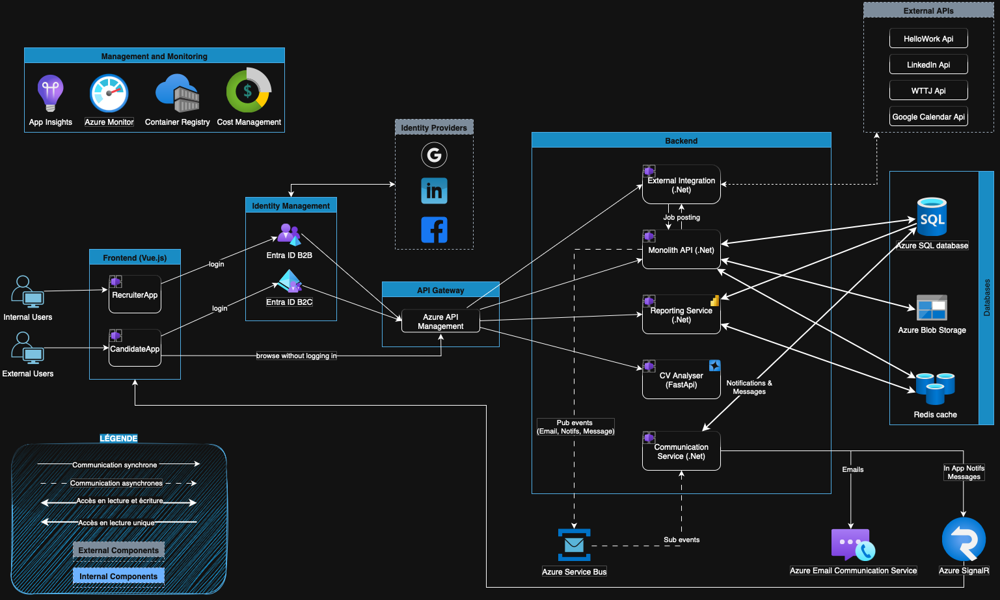
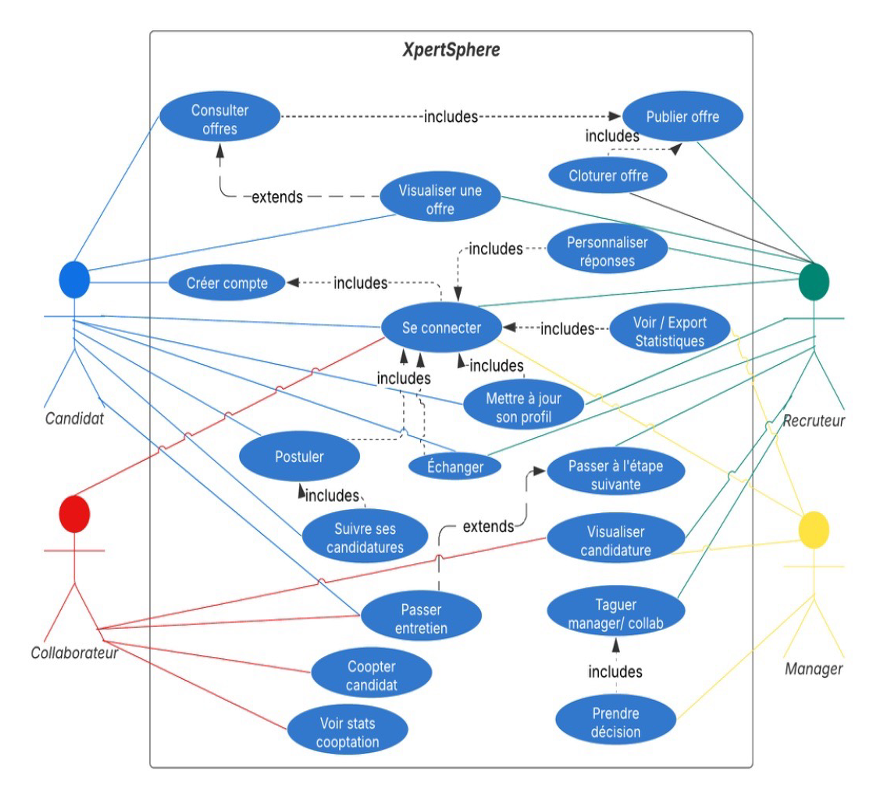
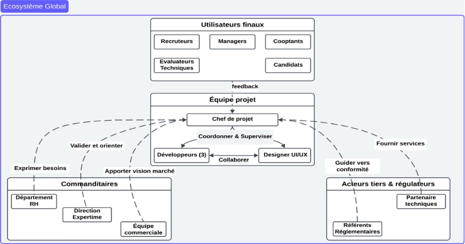

# Chapitre 3 — Conception et architecture logicielle

La conception de XpertSphere repose sur un ensemble de décisions qui n'ont pas été prises isolément. Chacune répond à une contrainte identifiée au cours des chapitres précédents, qu'elle soit fonctionnelle, contextuelle ou réglementaire. Ce chapitre expose la logique architecturale du système, depuis les principes qui ont guidé les choix de structure jusqu'à la manière dont la plateforme gère la coexistence de plusieurs organisations dans un environnement partagé. L'objectif n'est pas de décrire chaque détail d'implémentation, mais de rendre lisible la cohérence d'ensemble qui relie les choix entre eux.

## 3.1 Principes architecturaux retenus

### 3.1.1 Modularité et découpage des responsabilités

L'architecture de XpertSphere suit un principe de séparation claire des responsabilités. Chaque composant du système est conçu pour exercer une fonction délimitée, sans empiéter sur celles des autres. Cette discipline, souvent désignée par le principe de responsabilité unique (*Single Responsibility Principle*), conduit à une organisation du code où les contrôleurs, les services et les modèles jouent chacun un rôle précis et ne sont pas interchangeables.

Dans la pratique, cela se traduit par un découpage en couches. Les contrôleurs reçoivent les requêtes HTTP, effectuent les validations initiales et délèguent le traitement aux services applicatifs. Ces services concentrent la logique métier et s'appuient sur le contexte de données pour accéder aux entités persistées. Les modèles, quant à eux, ne contiennent que les attributs et les propriétés calculées directement liées à l'entité qu'ils représentent. Cette organisation évite les couplages imprévus et facilite la maintenance, car une modification dans les règles métier n'oblige pas à revoir les mécanismes d'accès aux données.

Ce découpage s'applique également à la séparation entre les interfaces et leurs implémentations. Chaque service expose une interface que les consommateurs utilisent. L'implémentation concrète reste cachée derrière cette interface, ce qui facilite les évolutions et les tests, tout en rendant la structure du système lisible indépendamment de ses détails internes.

### 3.1.2 Injection de dépendances

L'injection de dépendances (*Dependency Injection*, DI) constitue un mécanisme structurant dans la conception de XpertSphere. Elle permet à chaque composant de recevoir ses collaborateurs au moment de sa création, sans en connaître l'implémentation exacte. Le framework ASP.NET Core, sur lequel repose la couche backend, intègre un conteneur d'injection de dépendances nativement. XpertSphere en tire parti pour enregistrer les services, les configurations et les dépendances d'infrastructure, puis les injecter là où ils sont nécessaires.

Cette approche apporte plusieurs bénéfices concrets. Elle évite les références statiques et les singletons fragiles. Elle rend chaque composant testable de manière isolée, car les dépendances peuvent être substituées par des versions de test sans modifier le code de production. Elle clarifie aussi les relations entre les composants, puisque les dépendances deviennent explicites dans les constructeurs plutôt que disséminées dans le code.

### 3.1.3 Pattern Repository et organisation des services

Le pattern Repository, tel qu'il est utilisé dans XpertSphere, consiste à faire transiter toutes les opérations d'accès aux données par des services dédiés. Chaque entité métier dispose d'un service correspondant, exposé via une interface. Ce service encapsule les requêtes, les validations et les transformations nécessaires, en faisant le lien entre la logique métier et le contexte de persistance. Les contrôleurs ne communiquent pas directement avec la base de données : ils passent par les services, qui gèrent eux-mêmes l'accès aux données via le contexte Entity Framework Core.

Cette organisation rend les règles d'accès plus faciles à centraliser et à vérifier. Elle évite notamment que des filtrages importants, comme l'isolation des données par organisation, soient oubliés dans certains contrôleurs. Le service devient un point de passage obligé, ce qui renforce la cohérence du traitement, en particulier pour les opérations sensibles.

### 3.1.4 Progressivité comme principe de conception

Un principe transversal oriente la conception de XpertSphere : la progressivité. La plateforme ne cherche pas à imposer un usage complet et immédiat. Elle est pensée pour que chaque fonctionnalité apporte de la valeur dès ses premiers usages, tout en laissant la possibilité d'aller plus loin à mesure que l'organisation gagne en maturité.

Ce principe se manifeste concrètement dans plusieurs aspects. Le profil candidat peut être complété progressivement, sans que son caractère incomplet bloque le processus de candidature. Les organisations peuvent opérer avec une configuration minimale, puis enrichir leurs paramètres. Les rôles et permissions peuvent être ajustés sans intervention technique. Dans la structure même du code, la séparation en modules permet d'introduire de nouvelles capacités, comme un service de communication ou un service d'intégration, sans perturber le cœur de l'application.

Cette logique répond directement au contexte décrit en introduction : les organisations visées ne sont pas toutes à un niveau de maturité numérique identique. Une architecture rigide qui exigerait une configuration complète avant d'être utile aurait peu de chances d'être adoptée durablement dans un environnement où la transition vers le numérique reste en cours.

## 3.2 Architecture globale du système

### 3.2.1 Vue d'ensemble

L'architecture de XpertSphere repose sur une organisation en couches, avec un backend centralisé exposant une API REST et deux applications frontend distinctes. Cette organisation reflète la séparation des parcours utilisateurs identifiée lors des spécifications : l'espace candidat et l'espace recruteur ont des besoins et des interactions suffisamment différents pour justifier deux interfaces indépendantes, tout en partageant la même couche d'API et de données.

Le diagramme suivant illustre l'organisation globale du système à un niveau macro.

*Figure 3.1 — Architecture globale de XpertSphere (développement local)*

Le schéma met en évidence la structure en couches et les principaux flux de communication entre les composants. On y retrouve les deux applications frontend, le backend API, la couche de données et les services périphériques, dont les responsabilités sont décrites dans les sections suivantes.

### 3.2.2 Couche backend : l'API centrale

Le backend de XpertSphere est conçu comme une API monolithique modulaire, développée avec ASP.NET Core. Ce choix correspond à la phase actuelle du projet : un monolithe bien structuré offre une cohérence plus simple à maintenir qu'une architecture distribuée, notamment lorsque les frontières de découpe ne sont pas encore totalement stabilisées. Le code est organisé de manière à ne pas créer de dépendances circulaires entre les modules fonctionnels, ce qui ménage une voie d'évolution vers une décomposition plus fine si le besoin devait se confirmer à l'usage.

La couche backend distingue plusieurs responsabilités bien délimitées. Les contrôleurs constituent le point d'entrée des requêtes. Chacun gère un périmètre fonctionnel précis : gestion des offres, des candidatures, des utilisateurs, des organisations, des rôles et permissions, ou encore de l'historique des statuts. Les services applicatifs concentrent la logique de traitement. Ils coordonnent les accès aux données, appliquent les règles métier et produisent les réponses que les contrôleurs renvoient aux clients. Le contexte de données, fondé sur Entity Framework Core, assure la persistance.

En dehors du noyau monolithique, plusieurs services spécialisés existent dans la structure du projet. Un service de communication, un service d'intégration, un service d'analyse de CV et un service de rapports sont identifiés comme modules distincts. Ces modules restent indépendants du cœur applicatif et peuvent évoluer à leur propre rythme. Leur présence dans l'architecture traduit une anticipation des besoins futurs, sans imposer une complexité prématurée dans la phase courante.

### 3.2.3 Couche frontend : deux applications distinctes

Le frontend est organisé en deux applications Vue.js indépendantes, développées dans un dépôt monorepo. La première est orientée candidat : elle couvre la découverte des offres, le dépôt de candidature et le suivi des candidatures déposées. La seconde est orientée recruteur et organisation : elle permet de gérer les offres, de suivre les candidatures, de piloter les rôles et de consulter les tableaux de bord.

Cette séparation présente plusieurs avantages. Elle limite la surface d'exposition de chaque application aux fonctionnalités réellement utiles à son audience. Elle réduit le risque de confusion entre des écrans et des permissions destinés à des rôles différents. Elle permet également de faire évoluer chaque interface à son propre rythme, selon les retours des utilisateurs correspondants.

### 3.2.4 Infrastructure et services transverses

La couche d'infrastructure couvre la persistance des données, la gestion des fichiers et les mécanismes d'authentification. En développement local, la persistance repose sur une base de données SQL Server, configurée via Docker Compose pour simplifier la mise en place de l'environnement. Les fichiers, tels que les CV, sont stockés via un service de blob, dont l'interface est abstraite de manière à pouvoir s'appuyer sur Azure Blob Storage dans un environnement de production sans modifier le code applicatif.

L'authentification est configurable. Deux modes coexistent dans la codebase : un mode local basé sur ASP.NET Identity, utilisé en développement, et un mode s'appuyant sur Microsoft Entra ID (anciennement Azure Active Directory), activé pour les environnements non locaux. Cette dualité permet de ne pas imposer une dépendance cloud pendant les phases de développement, tout en maintenant une trajectoire cohérente vers une infrastructure managée.

Dans les environnements hors développement, des services complémentaires s'ajoutent : Azure Key Vault pour la gestion des secrets, Application Insights pour la télémétrie et la supervision. Ces services ne sont pas simulés en local, mais leur intégration est préparée dans le code de configuration, de sorte que l'activation reste peu invasive.

## 3.3 Modélisation UML

### 3.3.1 Cas d'utilisation

Le diagramme de cas d'utilisation permet d'identifier les acteurs du système et les fonctionnalités auxquelles chacun a accès. Dans XpertSphere, trois acteurs principaux se distinguent. Le candidat interagit avec la plateforme pour découvrir les offres, gérer son profil, déposer des candidatures et consulter leur état. Le recruteur opère au sein d'une organisation pour créer et gérer les offres, accéder aux candidatures et faire progresser le pipeline. Le manager et l'évaluateur technique constituent des rôles complémentaires qui interviennent dans l'évaluation des candidatures, avec des périmètres d'action plus ciblés. L'administrateur de plateforme dispose quant à lui d'un accès transverse aux configurations et aux organisations.

Le diagramme ci-dessous représente ces interactions à un niveau agrégé.

*Figure 3.2 — Diagramme de cas d'utilisation de XpertSphere*

### 3.3.2 Modèle de classes du domaine

Le modèle de domaine de XpertSphere s'organise autour de quelques entités centrales. L'entité `Organization` représente une entreprise cliente de la plateforme. Elle constitue l'unité d'isolation du modèle multi-entreprises : toutes les offres et les opérations internes d'une organisation lui sont rattachées via un identifiant d'organisation. L'entité `User` couvre à la fois les membres d'une organisation et les candidats. La distinction entre ces deux usages est portée par la présence ou l'absence d'un identifiant d'organisation associé à l'utilisateur.

L'entité `JobOffer` représente une offre d'emploi publiée par une organisation. Elle est systématiquement rattachée à une organisation et contient les informations nécessaires à sa publication, son mode de travail, son type de contrat et ses conditions. L'entité `Application` représente la candidature d'un utilisateur à une offre. Elle lie un profil candidat à une offre et porte le statut courant de la candidature. L'entité `ApplicationStatusHistory` enregistre chaque changement de statut, avec le commentaire, l'évaluateur et l'horodatage correspondants. Elle constitue la trace d'audit du pipeline de recrutement.

La gestion des rôles et des permissions repose sur un ensemble d'entités complémentaires. Les entités `Role`, `Permission`, `RolePermission` et `UserRole` permettent d'exprimer des droits d'accès fins, distincts selon les périmètres fonctionnels. Cette modélisation supporte les règles de contrôle d'accès basé sur les rôles (*Role-Based Access Control*, RBAC) appliquées dans les couches de service et de contrôleur.

[À FAIRE — Figure 3.3 : diagramme de classes UML du domaine métier (E/A), à produire avec les entités Organization, User, JobOffer, Application, ApplicationStatusHistory, Role, Permission, UserRole]

### 3.3.3 Diagrammes de séquence

Les diagrammes de séquence permettent de représenter les flux d'interaction entre les composants du système lors des opérations principales. Parmi les flux à modéliser en priorité, le dépôt de candidature illustre bien la coordination entre les acteurs : le candidat soumet sa candidature via l'interface, l'API valide la requête, crée l'entité `Application`, enregistre un premier statut dans l'historique et confirme la réception. Le flux de parsing de CV implique quant à lui le service d'analyse de CV, qui traite le document déposé et en extrait les informations structurées pour enrichir le profil.

Le diagramme d'interactions ci-dessous fournit une vue complémentaire des échanges entre les composants du système.

*Figure 3.4 — Diagramme d'interactions entre les composants de XpertSphere*

[À FAIRE — Figure 3.5 : diagramme de séquence UML détaillé pour le flux "dépôt de candidature"]

[À FAIRE — Figure 3.6 : diagramme de séquence UML pour le flux "analyse de CV"]

### 3.3.4 Diagramme de déploiement

L'environnement d'exécution cible peut être décrit à deux niveaux. En développement local, le système repose sur Docker Compose, qui orchestre la base de données et l'API backend. Les deux applications frontend sont servies localement par des serveurs de développement distincts. Cet environnement est entièrement reproductible à partir du fichier de configuration du projet.

La cible de déploiement envisagée s'appuie sur les services Azure. L'API backend serait hébergée sur un service de conteneurs managé, la base de données sur Azure SQL Database, et les fichiers sur Azure Blob Storage. La gestion des secrets serait confiée à Azure Key Vault, et la supervision à Application Insights. Cette architecture cible reste une perspective d'industrialisation qui oriente les choix de conception, sans représenter un déploiement effectivement réalisé dans le périmètre de ce mémoire.

[À FAIRE — Figure 3.7 : diagramme de déploiement UML (environnement local Docker Compose + cible Azure)]

## 3.4 Stratégie de gestion multi-entreprises

### 3.4.1 Les patterns de multi-tenancy

La gestion multi-entreprises, désignée techniquement par le terme *multi-tenancy*, consiste à faire coexister plusieurs clients, ou *tenants*, au sein d'une même instance applicative, tout en garantissant l'isolation de leurs données. Trois patterns principaux structurent le débat dans ce domaine.

Le premier pattern consiste à attribuer à chaque entreprise une base de données dédiée. Cette approche offre le niveau d'isolation le plus élevé. Chaque client dispose d'un espace de stockage séparé, sans risque de collision ou d'exposition involontaire. En contrepartie, elle est coûteuse à opérer : multiplier les bases de données implique de multiplier les ressources, les sauvegardes et les opérations de maintenance. Elle convient davantage aux contextes où les exigences de conformité sont très strictes et où les clients disposent des moyens pour financer cette isolation.

Le deuxième pattern repose sur l'utilisation de schémas distincts au sein d'une même base de données. Chaque entreprise obtient son propre schéma, avec ses propres tables. L'isolation des données reste forte, sans exiger le coût d'une base par client. Cette approche présente néanmoins des complexités opérationnelles non négligeables, notamment lors des migrations de schéma, qui doivent être appliquées à chaque tenant de manière coordonnée.

Le troisième pattern, souvent appelé base mutualisée avec discriminant de tenant, consiste à stocker les données de toutes les entreprises dans les mêmes tables, en les distinguant par un identifiant d'appartenance. Chaque enregistrement porte un champ qui l'associe à une organisation. L'isolation est alors assurée par la logique applicative plutôt que par la structure de la base. Ce pattern est le moins coûteux à déployer et à maintenir. Il suppose en revanche une rigueur forte dans le code : toute requête qui omet le filtre d'organisation expose potentiellement des données d'une entreprise à une autre.

### 3.4.2 Le pattern retenu pour XpertSphere

XpertSphere adopte le troisième pattern : une base de données mutualisée, avec un identifiant d'organisation porté par chaque entité rattachée à une entreprise. Ce choix est cohérent avec les contraintes économiques et opérationnelles du contexte visé. La plateforme s'adresse à des organisations qui cherchent précisément à mutualiser les coûts d'infrastructure. Imposer une base dédiée par client rendrait le modèle économique peu viable pour des structures de taille intermédiaire.

Ce choix est également cohérent avec la phase actuelle du projet. Un déploiement local, puis une migration vers Azure, se gèrent plus simplement avec une architecture à base unique. Les migrations de schéma restent centralisées, les sauvegardes sont uniformes et la configuration ne multiplie pas les environnements isolés.

Dans le modèle de données, cela se traduit concrètement par la présence d'un champ `OrganizationId` sur toutes les entités qui appartiennent à une organisation. La table `JobOffer`, par exemple, référence systématiquement l'organisation qui l'a créée. La table `Application` hérite de cette appartenance indirectement, via l'offre à laquelle elle est rattachée. Les utilisateurs membres d'une organisation portent eux aussi cet identifiant, ce qui permet de distinguer clairement les comptes candidats des comptes rattachés à une structure.

### 3.4.3 Mécanismes d'isolation

L'isolation des données ne repose pas uniquement sur la présence d'un champ discriminant. Elle exige une discipline d'application systématique dans toutes les couches qui accèdent aux données.

Au niveau des services, chaque opération de lecture ou de modification qui porte sur des données d'organisation intègre un filtre explicite sur l'identifiant d'organisation. Ce filtre n'est pas laissé à l'appréciation de chaque développeur : il est attendu comme une règle de conception. La tentation d'effectuer des requêtes sans ce filtre, par souci de simplification ou par inadvertance, constitue le risque principal de ce pattern.

Au niveau des contrôleurs, les droits d'accès sont vérifiés avant de déléguer au service. Le service d'utilisateur courant fournit le contexte d'identité, notamment l'organisation à laquelle l'utilisateur appartient, ce qui permet aux couches applicatives d'appliquer les règles de périmètre sans dépendre de paramètres passés manuellement.

Le système de rôles et de permissions complète ce dispositif. XpertSphere distingue des rôles de plateforme et des rôles d'organisation. Les rôles de plateforme couvrent des actions d'administration transversales, tandis que les rôles d'organisation s'appliquent dans le périmètre d'une entreprise précise. Cette séparation évite qu'un utilisateur puisse, par escalade de privilèges ou par confusion de périmètre, agir sur des données qui n'appartiennent pas à son organisation.

### 3.4.4 Le vivier candidat : une logique transverse

Une tension conceptuelle mérite d'être explicitée. Le vivier candidat repose sur des profils qui existent indépendamment de toute organisation. Un candidat peut postuler à des offres de plusieurs entreprises, et son profil doit rester cohérent à travers ces candidatures. Cette logique est transverse par nature : elle ne se rattache pas à une seule organisation.

La solution adoptée consiste à distinguer deux niveaux dans le modèle. Le profil candidat, représenté par l'entité `User` sans identifiant d'organisation, constitue la partie partageable et réutilisable. La candidature, représentée par l'entité `Application`, rattache ce profil à une offre précise et appartient de facto à l'organisation qui a publié cette offre. Les informations propres au processus de sélection d'une organisation restent donc isolées dans la table des candidatures et dans l'historique des statuts, tandis que les informations de profil restent accessibles au candidat lui-même sans appartenir à une organisation particulière.

Cette distinction permet de concilier deux exigences qui semblent opposées : d'un côté, la capacité à construire un vivier candidat exploitable dans le temps ; de l'autre, l'isolation stricte des données de recrutement entre organisations. Elle est aussi cohérente avec les exigences réglementaires, puisque le profil candidat appartient à son titulaire et peut être géré, mis à jour ou supprimé indépendamment de ses candidatures passées.

### 3.4.5 Pertinence dans le contexte local

La mutualisation que permet le pattern retenu est particulièrement pertinente dans le contexte sénégalais. Une organisation de taille intermédiaire n'a généralement pas la capacité — ni l'intérêt — de financer une infrastructure dédiée pour gérer ses recrutements. Une plateforme partagée, où les coûts d'exploitation sont dilués sur l'ensemble des organisations clientes, répond mieux à cette réalité économique. Elle rend le service accessible à des acteurs qui seraient autrement contraints d'utiliser des outils génériques inadaptés ou de maintenir des processus entièrement manuels.

Cette logique de mutualisation ne doit pas être confondue avec une absence d'isolation. Les organisations partagent une infrastructure, pas leurs données. Chaque entreprise travaille dans un périmètre qui lui est propre, sans avoir accès aux offres, aux candidatures ni aux configurations d'une autre. L'architecture garantit cette séparation par conception, pas seulement par convention.

---

Ce chapitre a présenté les choix de conception qui structurent XpertSphere : les patterns architecturaux qui organisent le code, la découpe en composants qui répartit les responsabilités, et la stratégie multi-entreprises qui permet à la plateforme d'être partagée sans sacrifier l'isolation. Ces choix ne sont pas arbitraires. Ils répondent aux exigences formulées au chapitre précédent et anticipent les contraintes opérationnelles du contexte visé. La partie suivante décrit comment ces décisions architecturales se traduisent dans la réalisation technique concrète de la plateforme.
