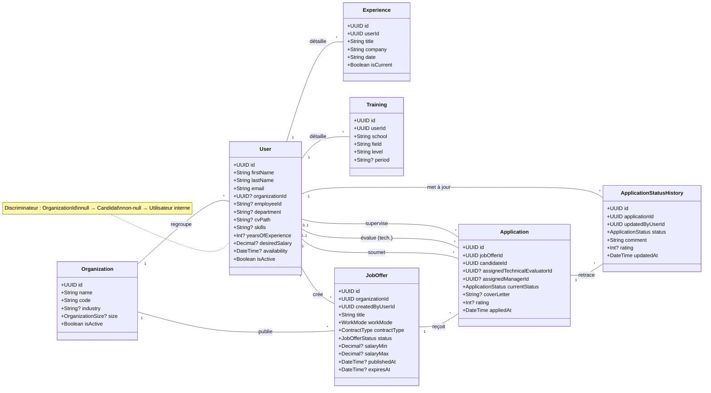

# Figure 3.3a : Diagramme de classes — Domaine recrutement

```mermaid
classDiagram
    direction LR

    note for User "Discriminateur : OrganizationId\nnull → Candidat\nnon-null → Utilisateur interne"

    class Organization {
        +UUID id
        +String name
        +String code
        +String? industry
        +OrganizationSize? size
        +Boolean isActive
    }

    class User {
        +UUID id
        +String firstName
        +String lastName
        +String email
        +UUID? organizationId
        +String? employeeId
        +String? department
        +String? cvPath
        +String? skills
        +Int? yearsOfExperience
        +Decimal? desiredSalary
        +DateTime? availability
        +Boolean isActive
    }

    class Experience {
        +UUID id
        +UUID userId
        +String title
        +String company
        +String date
        +Boolean isCurrent
    }

    class Training {
        +UUID id
        +UUID userId
        +String school
        +String field
        +String level
        +String? period
    }

    class JobOffer {
        +UUID id
        +UUID organizationId
        +UUID createdByUserId
        +String title
        +WorkMode workMode
        +ContractType contractType
        +JobOfferStatus status
        +Decimal? salaryMin
        +Decimal? salaryMax
        +DateTime? publishedAt
        +DateTime? expiresAt
    }

    class Application {
        +UUID id
        +UUID jobOfferId
        +UUID candidateId
        +UUID? assignedTechnicalEvaluatorId
        +UUID? assignedManagerId
        +ApplicationStatus currentStatus
        +String? coverLetter
        +Int? rating
        +DateTime appliedAt
    }

    class ApplicationStatusHistory {
        +UUID id
        +UUID applicationId
        +UUID updatedByUserId
        +ApplicationStatus status
        +String comment
        +Int? rating
        +DateTime updatedAt
    }

    Organization "1" -- "*" User : regroupe
    Organization "1" -- "*" JobOffer : publie
    User "1" -- "*" JobOffer : crée
    User "1" -- "*" Experience : détaille
    User "1" -- "*" Training : détaille

    JobOffer "1" -- "*" Application : reçoit
    User "1" -- "*" Application : soumet
    User "0..1" -- "*" Application : évalue (tech.)
    User "0..1" -- "*" Application : supervise

    Application "1" -- "*" ApplicationStatusHistory : retrace
    User "1" -- "*" ApplicationStatusHistory : met à jour
```
