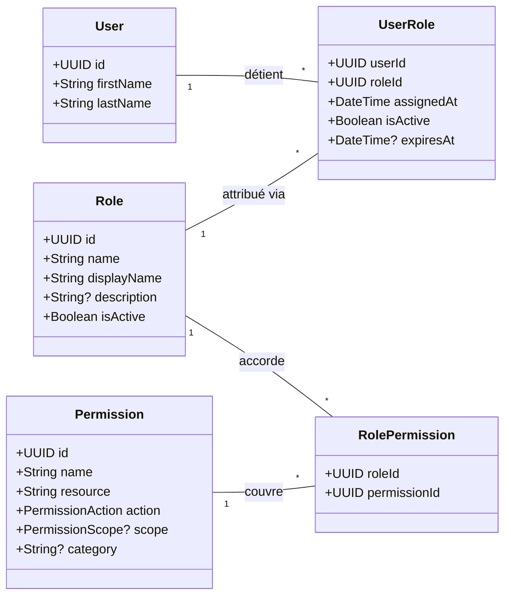

# Figure 3.3b : Diagramme de classes — Modèle de contrôle d'accès (RBAC)

```mermaid
classDiagram
    direction LR

    class User {
        +UUID id
        +String firstName
        +String lastName
    }

    class UserRole {
        +UUID userId
        +UUID roleId
        +DateTime assignedAt
        +Boolean isActive
        +DateTime? expiresAt
    }

    class Role {
        +UUID id
        +String name
        +String displayName
        +String? description
        +Boolean isActive
    }

    class RolePermission {
        +UUID roleId
        +UUID permissionId
    }

    class Permission {
        +UUID id
        +String name
        +String resource
        +PermissionAction action
        +PermissionScope? scope
        +String? category
    }

    User "1" -- "*" UserRole : détient
    Role "1" -- "*" UserRole : attribué via
    Role "1" -- "*" RolePermission : accorde
    Permission "1" -- "*" RolePermission : couvre
```
