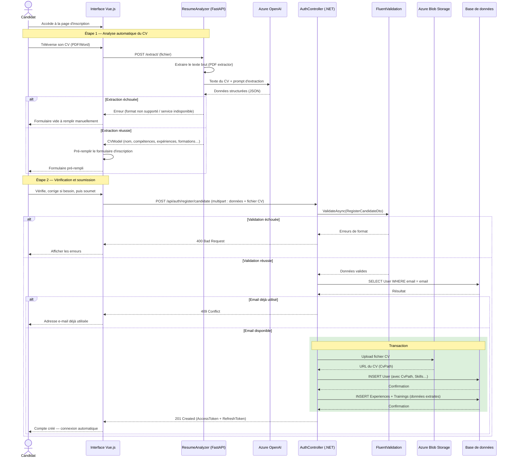

# Figure 3.4 : Séquence — Création de compte candidat

```mermaid
sequenceDiagram
    actor Candidat
    participant Vue as Interface Vue.js
    participant CVA as ResumeAnalyzer (FastAPI)
    participant AI as Azure OpenAI
    participant API as AuthController (.NET)
    participant FV as FluentValidation
    participant Blob as Azure Blob Storage
    participant DB as Base de données

    Candidat->>Vue: Accède à la page d'inscription

    Note over Candidat,CVA: Étape 1 — Analyse automatique du CV

    Candidat->>Vue: Téléverse son CV (PDF/Word)
    Vue->>CVA: POST /extract/ (fichier)
    CVA->>CVA: Extraire le texte brut (PDF extractor)
    CVA->>AI: Texte du CV + prompt d'extraction
    AI-->>CVA: Données structurées (JSON)

    alt Extraction échouée
        CVA-->>Vue: Erreur (format non supporté / service indisponible)
        Vue-->>Candidat: Formulaire vide à remplir manuellement
    else Extraction réussie
        CVA-->>Vue: CVModel (nom, compétences, expériences, formations…)
        Vue->>Vue: Pré-remplir le formulaire d'inscription
        Vue-->>Candidat: Formulaire pré-rempli
    end

    Note over Candidat,Vue: Étape 2 — Vérification et soumission

    Candidat->>Vue: Vérifie, corrige si besoin, puis soumet
    Vue->>API: POST /api/auth/register/candidate (multipart : données + fichier CV)

    API->>FV: ValidateAsync(RegisterCandidateDto)

    alt Validation échouée
        FV-->>API: Erreurs de format
        API-->>Vue: 400 Bad Request
        Vue-->>Candidat: Afficher les erreurs
    else Validation réussie
        FV-->>API: Données valides

        API->>DB: SELECT User WHERE email = email
        DB-->>API: Résultat

        alt Email déjà utilisé
            API-->>Vue: 409 Conflict
            Vue-->>Candidat: Adresse e-mail déjà utilisée
        else Email disponible
            rect rgb(220, 240, 220)
                Note over API,DB: Transaction
                API->>Blob: Upload fichier CV
                Blob-->>API: URL du CV (CvPath)

                API->>DB: INSERT User (avec CvPath, Skills…)
                DB-->>API: Confirmation

                API->>DB: INSERT Experiences + Trainings (données extraites)
                DB-->>API: Confirmation
            end

            API-->>Vue: 201 Created (AccessToken + RefreshToken)
            Vue-->>Candidat: Compte créé — connexion automatique
        end
    end
```
