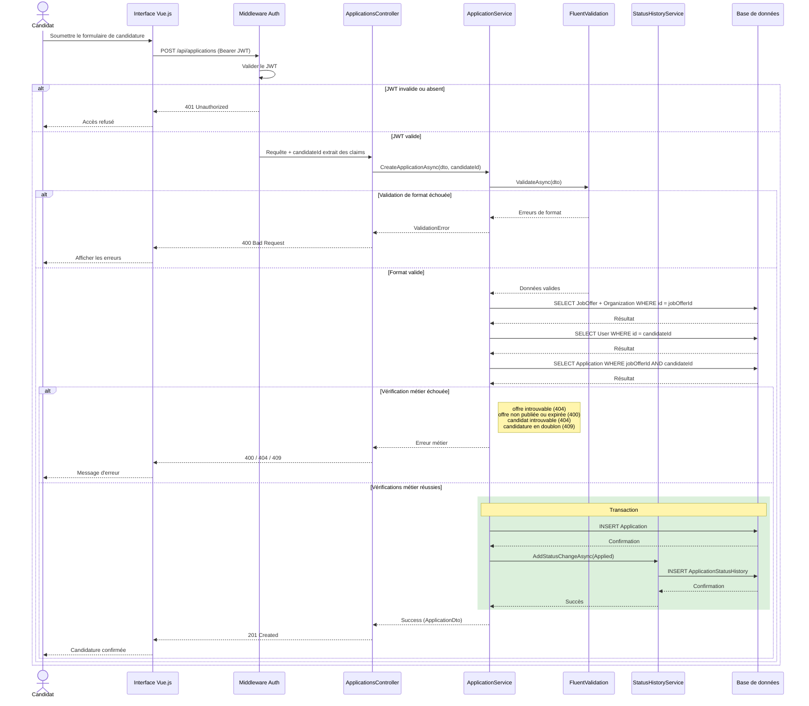

# Figure 3.5 : Séquence — Dépôt de candidature

```mermaid
sequenceDiagram
    actor Candidat
    participant Vue as Interface Vue.js
    participant Mid as Middleware Auth
    participant API as ApplicationsController
    participant Svc as ApplicationService
    participant FV as FluentValidation
    participant HistSvc as StatusHistoryService
    participant DB as Base de données

    Candidat->>Vue: Soumettre le formulaire de candidature
    Vue->>Mid: POST /api/applications (Bearer JWT)

    Mid->>Mid: Valider le JWT

    alt JWT invalide ou absent
        Mid-->>Vue: 401 Unauthorized
        Vue-->>Candidat: Accès refusé
    else JWT valide
        Mid->>API: Requête + candidateId extrait des claims

        API->>Svc: CreateApplicationAsync(dto, candidateId)

        Svc->>FV: ValidateAsync(dto)

        alt Validation de format échouée
            FV-->>Svc: Erreurs de format
            Svc-->>API: ValidationError
            API-->>Vue: 400 Bad Request
            Vue-->>Candidat: Afficher les erreurs
        else Format valide
            FV-->>Svc: Données valides

            Svc->>DB: SELECT JobOffer + Organization WHERE id = jobOfferId
            DB-->>Svc: Résultat

            Svc->>DB: SELECT User WHERE id = candidateId
            DB-->>Svc: Résultat

            Svc->>DB: SELECT Application WHERE jobOfferId AND candidateId
            DB-->>Svc: Résultat

            alt Vérification métier échouée
                Note right of Svc: offre introuvable (404)<br/>offre non publiée ou expirée (400)<br/>candidat introuvable (404)<br/>candidature en doublon (409)
                Svc-->>API: Erreur métier
                API-->>Vue: 400 / 404 / 409
                Vue-->>Candidat: Message d'erreur
            else Vérifications métier réussies
                rect rgb(220, 240, 220)
                    Note over Svc,DB: Transaction
                    Svc->>DB: INSERT Application
                    DB-->>Svc: Confirmation

                    Svc->>HistSvc: AddStatusChangeAsync(Applied)
                    HistSvc->>DB: INSERT ApplicationStatusHistory
                    DB-->>HistSvc: Confirmation
                    HistSvc-->>Svc: Succès
                end

                Svc-->>API: Success (ApplicationDto)
                API-->>Vue: 201 Created
                Vue-->>Candidat: Candidature confirmée
            end
        end
    end
```
