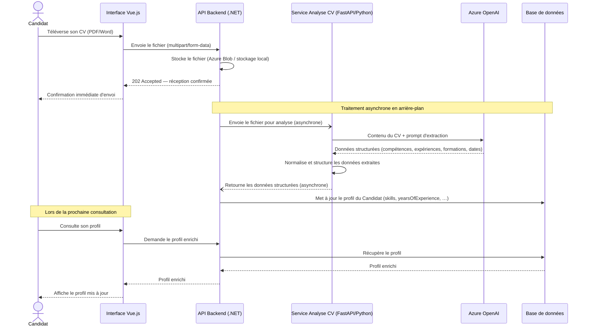

# Figure 3.6 : Séquence — Analyse automatique de CV

```mermaid
sequenceDiagram
    actor Candidat
    participant Vue as Interface Vue.js
    participant API as API Backend (.NET)
    participant CV as Service Analyse CV (FastAPI/Python)
    participant AI as Azure OpenAI
    participant DB as Base de données

    Candidat->>Vue: Téléverse son CV (PDF/Word)
    Vue->>API: Envoie le fichier (multipart/form-data)
    API->>API: Stocke le fichier (Azure Blob / stockage local)
    API-->>Vue: 202 Accepted — réception confirmée
    Vue-->>Candidat: Confirmation immédiate d'envoi

    Note over API,DB: Traitement asynchrone en arrière-plan

    API-)CV: Envoie le fichier pour analyse (asynchrone)
    CV->>AI: Contenu du CV + prompt d'extraction
    AI-->>CV: Données structurées (compétences, expériences, formations, dates)
    CV->>CV: Normalise et structure les données extraites
    CV--)API: Retourne les données structurées (asynchrone)
    API->>DB: Met à jour le profil du Candidat (skills, yearsOfExperience, …)

    Note over Candidat,Vue: Lors de la prochaine consultation

    Candidat->>Vue: Consulte son profil
    Vue->>API: Demande le profil enrichi
    API->>DB: Récupère le profil
    DB-->>API: Profil enrichi
    API-->>Vue: Profil enrichi
    Vue-->>Candidat: Affiche le profil mis à jour
```
