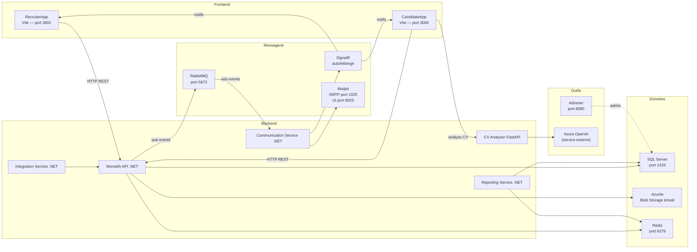

# Figure 3.7a : Déploiement — Environnement local (Docker Compose)

```mermaid
graph LR
    subgraph FRONTEND["Frontend"]
        REC["RecruiterApp\nVite — port 3001"]
        CAN["CandidateApp\nVite — port 3000"]
    end

    subgraph BACKEND["Backend"]
        MONO["Monolith API .NET"]
        CVA["CV Analyser FastAPI"]
        REP["Reporting Service .NET"]
        COM["Communication Service .NET"]
        INTSVC["Integration Service .NET"]
    end

    subgraph DATA["Données"]
        SQL["SQL Server\nport 1433"]
        BLOB["Azurite\nBlob Storage émulé"]
        REDIS["Redis\nport 6379"]
    end

    subgraph MSG["Messagerie"]
        MQ["RabbitMQ\nport 5672"]
        SIG["SignalR\nautohébergé"]
        MAIL["Mailpit\nSMTP port 1025\nUI port 8025"]
    end

    subgraph TOOLS["Outils"]
        ADM["Adminer\nport 8080"]
        OPENAI["Azure OpenAI\n(service externe)"]
    end

    REC -->|"HTTP REST"| MONO
    CAN -->|"HTTP REST"| MONO
    CAN -->|"analyse CV"| CVA

    MONO --> SQL
    MONO --> BLOB
    MONO --> REDIS
    MONO -->|"pub events"| MQ

    REP --> SQL
    REP --> REDIS

    MQ -->|"sub events"| COM
    COM --> MAIL
    COM --> SIG
    SIG -->|"notifs"| REC
    SIG -->|"notifs"| CAN

    CVA --> OPENAI

    INTSVC --> MONO

    ADM -.->|"admin"| SQL
```
