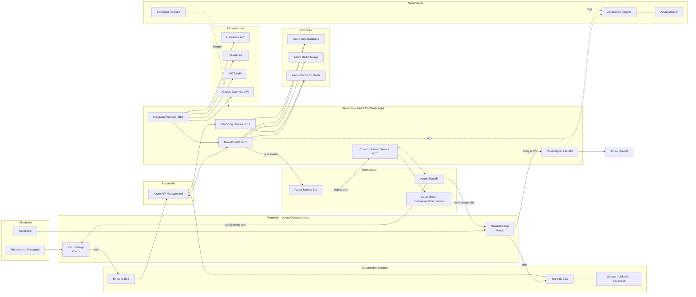

# Figure 3.7b : Déploiement — Environnement cible (Microsoft Azure)

```mermaid
graph LR
    subgraph USERS["Utilisateurs"]
        INT_U["Recruteurs / Managers"]
        EXT_U["Candidats"]
    end

    subgraph FRONTEND["Frontend — Azure Container Apps"]
        REC["RecruiterApp\nVue.js"]
        CAN["CandidateApp\nVue.js"]
    end

    subgraph IDENTITY["Gestion des identités"]
        B2B["Entra ID B2B"]
        B2C["Entra ID B2C"]
        SOC["Google · LinkedIn · Facebook"]
    end

    subgraph GATEWAY["Passerelle"]
        APIM["Azure API Management"]
    end

    subgraph BACKEND["Backend — Azure Container Apps"]
        MONO["Monolith API .NET"]
        CVA["CV Analyser FastAPI"]
        REP["Reporting Service .NET"]
        COM["Communication Service .NET"]
        INTSVC["Integration Service .NET"]
    end

    subgraph DATA["Données"]
        SQL["Azure SQL Database"]
        BLOB["Azure Blob Storage"]
        REDIS["Azure Cache for Redis"]
    end

    subgraph MSG["Messagerie"]
        BUS["Azure Service Bus"]
        SIG["Azure SignalR"]
        EMAILSVC["Azure Email Communication Service"]
    end

    subgraph EXT_APIS["APIs externes"]
        HW["HelloWork API"]
        LI["LinkedIn API"]
        WTTJ["WTTJ API"]
        GC["Google Calendar API"]
    end

    subgraph MONITORING["Supervision"]
        AI["Application Insights"]
        MON["Azure Monitor"]
        CR["Container Registry"]
    end

    OPENAI["Azure OpenAI"]

    INT_U --> REC
    EXT_U --> CAN

    REC -->|"auth"| B2B
    CAN -->|"auth"| B2C
    B2C --- SOC

    B2B --> APIM
    B2C --> APIM
    CAN -->|"analyse CV"| CVA

    APIM --> MONO
    APIM --> REP

    MONO --> SQL
    MONO --> BLOB
    MONO --> REDIS
    MONO -->|"pub events"| BUS

    REP --> SQL
    REP --> REDIS

    BUS -->|"sub events"| COM
    COM --> EMAILSVC
    COM --> SIG
    SIG -->|"notifs temps réel"| REC
    SIG -->|"notifs temps réel"| CAN

    CVA --> OPENAI

    INTSVC --> HW
    INTSVC --> LI
    INTSVC --> WTTJ
    INTSVC --> GC
    INTSVC --> MONO

    MONO -.->|"logs"| AI
    CVA -.->|"logs"| AI
    AI --- MON
    CR -.->|"images"| BACKEND
```
